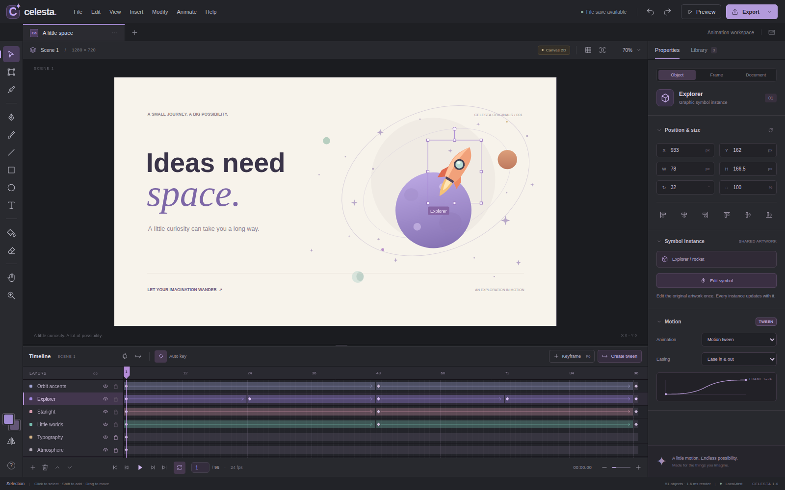

# Celesta Studio

**[Open Celesta Studio](https://wieslawsoltes.github.io/CelestaStudio/)** · [Build and deployment](https://github.com/wieslawsoltes/CelestaStudio/actions/workflows/pages.yml)

**A local-first vector animation editor, built with plain HTML, CSS, JavaScript, and a WebGPU rendering backend.**

Celesta has an Animate-style authoring workspace: a vector stage, tool rail, layer/keyframe timeline, property inspector, and reusable-symbol library. The included **A little space** animation is editable scene data, not a flattened preview image.

This is a working, independently implemented editor with a deliberately documented feature boundary. It is **not** a drop-in replacement for every Adobe Animate feature or file format.



## Run

The complete application is in **`dist/index.html`**. It has no external runtime dependencies, CDN requests, font downloads, account requirement, or backend service.

For development and WebGPU access, serve the repository on localhost:

```sh
python3 -m http.server 8000 --bind 127.0.0.1
```

Open **`http://localhost:8000/`** for the modular source application, or **`http://localhost:8000/dist/`** for the single-file build.

Opening `dist/index.html` directly is also useful for trying the editor, but GPU and persistent-storage availability depend on the browser and origin. The stage badge reports **WebGPU** or **Canvas 2D**, never a simulated backend. WebGPU requires a supporting browser, adapter, and secure context; use localhost for development or HTTPS for deployment. No experimental flags are required by the application. See the official [WebGPU troubleshooting guide](https://developer.chrome.com/docs/web-platform/webgpu/troubleshooting-tips).

When WebGPU is unavailable, initialization fails, the GPU device is lost, or the atlas fills, the editor switches to the Canvas 2D backend. Scene editing remains available.

## Start animating

Press **Space** to play the example. Scrub the timeline to inspect its poses. Select the rocket, move to another frame, press **F6**, and move or rotate it. The preceding tween updates from the actual keyframe data.

For a new animation, use **File → New animation**. Draw an object at frame 1; move to a later frame and insert a keyframe; change its position. Select the earlier frame and choose **Create tween**. The inspector offers seven easing modes. Auto key creates an interpolated-pose keyframe when editing between existing keys; disabling it edits the preceding key instead.

Convert artwork with **F8** to create a reusable graphic symbol. Double-click an instance, or click **Edit symbol**, to edit its shared artwork in isolation. Return with the Scene 1 breadcrumb. All instances then use the updated definition.

## Implemented functionality

| Area | Working features |
| --- | --- |
| Workspace | Dark authoring UI; resizable timeline; stage pan/zoom and fit; grid; 10-pixel snapping; property/library panels; context menus; compact-width layout |
| Drawing | Rectangles, rounded corners, ellipses, lines, cubic Bézier pen, simplified freehand brush paths, editable text, object fill and object erase |
| Selection | Topmost geometric hit testing, marquee, additive selection, move, resize, rotate, flip, stacking order, six alignment actions, copy/paste/duplicate, group and break apart |
| Path editing | Editable anchors and tangent handles; click-drag pen tangents; closed/open paths; Alt to break tangent symmetry |
| Animation | Layer visibility/locking/order, real keyframes and blank keys, keyframe dragging and clipboard, hold spans, motion tweens, topology-compatible path shape tweens, easing, onion skin, motion-path display, loop playback, frame-rate and duration settings |
| Symbols | Shared graphic definitions, library previews/search/drag-and-drop, instances, nested static symbol references, isolated artwork editing, cycle protection |
| Import | Validated Celesta project JSON, a documented editable SVG subset, embedded PNG/JPEG/WebP/GIF image assets; pasted and dropped images |
| Export | Editable project JSON, current-frame SVG/PNG, independent animated HTML player, frame-exact PNG sequence ZIP, browser-encoded video where MediaRecorder is supported |
| Reliability | Undo/redo transactions, cancellation, bounded history, debounced IndexedDB autosave when available, explicit manual save, strict project reconstruction, honest backend status and measured render/submit statistics |

The eraser removes objects rather than subtracting brush-shaped regions. The paint tool changes a selected object's fill; it is not a raster flood fill. These are intentionally named **Erase object** and **Paint fill** in the tooltips.

## Keyboard reference

| Action | Shortcut |
| --- | --- |
| Select / transform / edit nodes | V / Q / A |
| Pen / brush / line | P / B / N |
| Rectangle / ellipse / text | R / O / T |
| Paint fill / erase object | G / E |
| Pan / zoom tool | H / Z |
| Play / stop | Space |
| Previous / next frame | Comma / period |
| First / last frame | Home / End |
| Keyframe / blank keyframe | F6 / F7 |
| Convert to symbol / extend timeline | F8 / F5 |
| Group / break apart | Ctrl or Cmd + G / Shift + Ctrl or Cmd + G |
| Undo / redo | Ctrl or Cmd + Z / Shift + Ctrl or Cmd + Z |
| Save / open / export / preview | Ctrl or Cmd + S / O / E / Enter |
| Fit stage | Ctrl or Cmd + 0 |
| Finish open pen path | Enter |

Shortcut handlers do not intercept normal typing in fields. Function keys may require Fn on some keyboards.

## Export details

**Project JSON** preserves the editable layers, objects, keys, symbols, and embedded assets. Keep project files as backups even when browser autosave is available. Autosave is one recovery document per origin, not a multi-document asset-management system. The modified marker distinguishes pending edits from a completed browser-storage write; file saving remains available when storage is denied.

**SVG** exports the evaluated current frame as vector elements and embedded bitmap images. Text remains text and depends on available fonts. **PNG** exports the current frame at document resolution, independently of stage zoom.

**Animated HTML** embeds a separate Canvas 2D player and the project data. It plays without the editor, external scripts, or a hosting API. It is intentionally more portable than the WebGPU authoring backend.

**PNG sequence ZIP** samples every integer frame exactly and includes `manifest.json`. It is the appropriate output for deterministic frame delivery. **Video** uses the browser's real-time MediaRecorder, preferring VP9/VP8 WebM and accepting MP4 when exposed by that browser. It contains no audio, and frames can be dropped when rendering/encoding cannot keep pace. Video export is not a frame-exact offline encoder.

Raster export is limited to 16 megapixels per frame; in-memory PNG sequence data is limited to 512 MiB. Export has progress and cancellation.

## Build and tests

Node 20 or newer is required for the build and core tests. There are no npm packages to install for these commands:

```sh
npm test
npm run build
npm start
```

The build concatenates the dependency-ordered ES modules and inlines the stylesheet into `dist/index.html`. It does not transpile, minify, fetch assets, or contact a package registry.

The optional browser suite uses Python, Playwright, and Pillow:

```sh
python3 -m pip install playwright pillow
python3 -m playwright install chromium
npm run build
python3 tests/browser_integration.py
```

Without `CELESTA_URL`, the suite injects the standalone document into an opaque-origin page. That tests the portable Canvas 2D editing/export path but cannot validate origin-scoped storage or secure-context WebGPU. To test a served build, start the local server in another terminal and run:

```sh
CELESTA_URL=http://localhost:8000/dist/ python3 tests/browser_integration.py
```

`CHROMIUM_PATH` optionally selects an installed Chromium/Chrome executable. Otherwise the suite uses system Chromium when present, then Playwright's browser. The suite writes its backend and result list to `test-results/browser-report.json` and a screenshot to `test-results/workspace.png`. Use a clean test browser profile; the suite modifies the test document.

### Validation recorded with this delivery

**27/27 core tests and 23/23 browser workflow checks passed.** The browser suite covered playback, pointer editing, transactional undo, property changes, keyframe movement, grouping, symbols, pen/node/brush tools, SVG and image imports, preview playback, all export formats, strict project reopening, and compact layouts.

The available test browser ran **Canvas 2D in an opaque-origin page**. WebGPU shader compilation, adapter/driver behavior, GPU visual parity, hardware throughput, and IndexedDB recovery on a real origin were **not verified in that environment**. The included WebGPU implementation has compilation/error handling and fallback, but these results are not GPU benchmarks or a cross-browser certification. See `test-results/browser-report.json` and `test-results/core-tests.txt` for the recorded results.

## Scope and known limits

Celesta v1 does not read or write **FLA, XFL, SWF, ActionScript, or AIR**. It does not implement audio tracks, nested independently animated movie clips, IK/bones, camera timelines, masks, Boolean shape operations, filters, arbitrary blend modes, pressure-sensitive painting, or collaboration.

The GPU tessellator handles simple single-contour fills; it is not a robust arrangement engine for holes or self-intersecting polygons. Shape tweens require compatible object IDs and matching path anchor counts. Symbol definitions are shared static artwork, not independent timelines. Group opacity is inherited per primitive, not an isolated offscreen compositing group. There is one scene per project.

SVG import reconstructs basic shapes, groups, text, transforms, and paths—including cubic/quadratic curves and elliptical arcs. It does not execute source scripts. Compound contours are split with warnings; holes, paint-server gradients, external references, masks, filters, and stylesheet-driven appearance are not reproduced. Imported GIF assets have no authored frame track or deterministic animated-image timing; use static bitmaps for frame-exact exports. Browser-native text layout/rasterization is used rather than a custom text shaping engine; fonts are not bundled or embedded.

The editor is aimed at desktop pointer/keyboard authoring. The UI adapts at smaller widths but has not been validated as a full mobile or assistive-technology authoring environment. The implementation includes file/scene limits, but has not been fuzz-tested against arbitrary hostile documents. Large-scene profiling, additional GPU backends/drivers, richer text layout, and atlas lifecycle/eviction remain engineering validation work, not completed guarantees.

## Source map

```
src/math.js       Affine transforms, bounds, easing, cubic subdivision, triangulation
src/model.js      Scene evaluation, hit testing, keyframes, history, validation, storage
src/renderer.js   WebGPU batches/shaders/atlas and the Canvas 2D reference renderer
src/importer.js   Safe SVG reconstruction and path parsing
src/exporter.js   SVG, PNG helpers, standalone player, video, ZIP/PNG sequence
src/app.js        Editing transactions, UI, timeline, tools, inspector, orchestration
src/demo.js       Original editable animation and symbol definitions
src/icons.js      Inline SVG interface icon paths
```

See **[ARCHITECTURE.md](ARCHITECTURE.md)** for the data model, GPU layout, cache boundaries, transformation math, and extension points.

## Attribution and references

Celesta's code, icon paths, sample artwork, branding, and interface implementation are original to this project. Adobe Animate is a separate product; this project is not affiliated with or endorsed by Adobe. No Adobe application source, logos, fonts, or bundled assets are included.

Primary technical references consulted: [Adobe's timeline authoring documentation](https://helpx.adobe.com/animate/desktop/workspace-and-workflow/timeline.html), [WebGPU specification](https://www.w3.org/TR/webgpu/), and [WGSL specification](https://www.w3.org/TR/WGSL/). These references explain the platform and authoring concepts; they are not claims of file-format or feature equivalence.

License: **MIT**. See `LICENSE`.

## GitHub Pages

The `Pages` workflow validates the core and browser tests, builds the standalone application, and publishes `dist/` to GitHub Pages on pushes to `main`. Pull requests run the same checks without deploying. See [DEPLOYMENT.md](DEPLOYMENT.md) for details.
